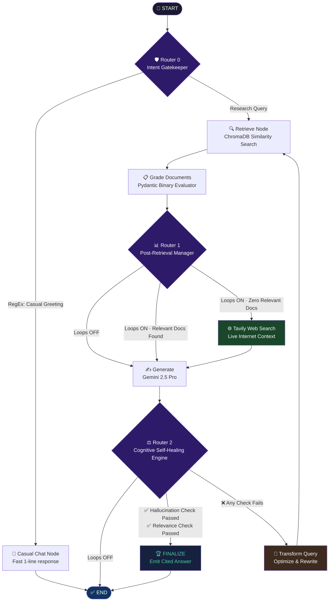

<div align="center">


# Cognitive Research Command Center
**Agentic RAG Research Assistant — Powered by LangGraph × Gemini 2.5**

[](https://python.org)
[](https://langchain-ai.github.io/langgraph/)
[](https://deepmind.google/technologies/gemini/)
[](https://fastapi.tiangolo.com)
[](https://streamlit.io)
[](https://trychroma.com)

[](https://agentic-research-assistant-835q3uqr9svtfabhj74lqu.streamlit.app/)
[](./evaluation/)
[](LICENSE)

*A self-correcting, multi-router cognitive agent that outperforms naive RAG through intent-aware routing, hallucination guardrails, adaptive query rewriting, and a real-time streaming UI — engineered to solve the three most critical production failures in enterprise RAG systems.*

[**🚀 Try the Live Demo**](https://agentic-research-assistant-835q3uqr9svtfabhj74lqu.streamlit.app/) · [**📐 Architecture**](#-architecture) · [**⚡ Quick Start**](#-quick-start) · [**📊 Evaluation**](#-evaluation-ragas)

</div>

---

## 🎯 The 3 Production Failures This Solves

Most RAG tutorials stop at "retrieve + generate." Production systems don't. This project was engineered from first principles to eliminate three critical failure modes that silently destroy enterprise RAG deployments:

| # | Production Failure | This System's Solution |
|---|---|---|
| 1 | **Runaway Token Drain** — Agents loop infinitely on ambiguous queries, burning API budgets in minutes | Global `recursion_limit: 15` step cap + `RetryPolicy(max_attempts=1)` circuit breaker on every heavy node |
| 2 | **The "Hello" Token Tax** — Every greeting triggers full vector search and multi-turn LLM chains | Intent Gatekeeper (Router 0) intercepts casual inputs via RegEx, bypasses the entire RAG pipeline, returns a response in milliseconds |
| 3 | **Confident Hallucinations** — Standard RAG outputs whatever the LLM returns with zero quality verification | Self-Healing Cognitive Loop (Router 2) runs hallucination grounding checks and answer relevance audits before any response reaches the user |

---

## ✨ Feature Highlights

- 🧠 **Agentic Loop Architecture** — Fully autonomous Plan → Retrieve → Grade → Self-Heal → Generate cycle powered by LangGraph's compiled state machine
- 🛡️ **3-Layer Quality Guardrails** — Binary Pydantic graders enforce structured `yes/no` evaluations at every quality gate, eliminating vague LLM scoring errors
- 🌐 **Live Web Search Fallback** — When local knowledge base relevance scores hit zero with loops enabled, the system dynamically reroutes to Tavily Search API for live internet context before generating
- 📄 **Multimodal PDF Ingestion** — Layout-aware parser isolates headers, tables, charts, and text blocks into structured chunks before embedding
- 🔒 **Session-Isolated Vector Collections** — Each user thread writes to its own `session_{id}` ChromaDB collection, completely preventing cross-user data bleed
- ⚡ **Real-Time SSE Token Streaming** — FastAPI `StreamingResponse` pushes token chunks to the frontend live, with a glowing cursor (`█`) that tracks character-by-character telemetry
- 🗄️ **Async SQLite Checkpointing** — `AsyncSqliteSaver` persists LangGraph's state machine memory with dynamic open/close connection lifecycles to eliminate memory leaks
- 🎨 **Premium Glassmorphism UI** — 20px frosted blur layers, edge-lit liquid gradient accents, and real-time streaming ribbons injected via custom CSS

---

## 🏗️ Architecture

### LangGraph Cognitive State Machine



### Request Lifecycle

```
User Input
    │
    ▼
FastAPI (Async Gateway)
    │  Pydantic Schema Validation
    │  StreamingResponse → SSE
    ▼
AsyncSqliteSaver (State Checkpointing)
    │
    ▼
LangGraph State Machine
    │
    ├── Router 0: Intent Classification
    │       └── Casual → fast exit
    │
    ├── ChromaDB (Session-Isolated Collections)
    │       └── 1536-dim vector similarity search
    │
    ├── Gemini 2.5 Flash (Graders)
    │       ├── Document Relevance Grader
    │       ├── Hallucination Grader
    │       └── Answer Usefulness Grader
    │
    ├── Gemini 2.5 Pro (Generator)
    │       └── Cited, structured final answer
    │
    └── Tavily API (Web Fallback)
            └── Live context when local KB fails
                │
                ▼
    SSE Token Stream → Streamlit Frontend
```

---

## 🛠️ Tech Stack

### AI & Orchestration
| Technology | Role |
|---|---|
| [LangGraph](https://langchain-ai.github.io/langgraph/) | State machine orchestration, conditional routing, retry policies |
| [Gemini 2.5 Flash](https://deepmind.google/technologies/gemini/) | Fast grading — document relevance, hallucination, usefulness checks |
| [Gemini 2.5 Pro](https://deepmind.google/technologies/gemini/) | High-quality final answer generation with citations |
| [LangChain](https://python.langchain.com/) | Prompt templates, document loaders, structured output binding |
| [Tavily API](https://tavily.com/) | Live web search fallback when local KB coverage is insufficient |
| [RAGAS](https://ragas.io/) | Automated evaluation — faithfulness, context recall, answer relevancy |

### Backend & Storage
| Technology | Role |
|---|---|
| [FastAPI](https://fastapi.tiangolo.com/) | Async API gateway with Server-Sent Events streaming |
| [ChromaDB](https://trychroma.com/) | Persistent 1536-dimensional vector store (session-isolated collections) |
| [aiosqlite](https://aiosqlite.omnilib.dev/) | Async SQLite for LangGraph state checkpointing |
| [Pydantic v2](https://docs.pydantic.dev/) | Strict schema validation, structured binary grader outputs |
| [PyPDF](https://pypdf.readthedocs.io/) | Layout-aware multimodal PDF parsing |

### Frontend
| Technology | Role |
|---|---|
| [Streamlit](https://streamlit.io/) | Interactive research UI with real-time SSE token streaming |
| Custom CSS | Glassmorphism design system — frosted blur, liquid gradients, glow effects |

---

## 📁 Project Structure

```
agentic-research-assistant/
│
├── backend/
│   ├── app/
│   │   ├── main.py              # FastAPI server · async SSE streaming · session management
│   │   │
│   │   ├── core/
│   │   │   ├── config.py        # Pydantic settings · environment control
│   │   │   └── llm.py           # Gemini Flash / Pro model factories
│   │   │
│   │   ├── graph/
│   │   │   ├── state.py         # GraphState TypedDict · central data contract
│   │   │   ├── nodes.py         # All node logic: retrieve, grade, generate, heal
│   │   │   └── workflow.py      # Compiled StateGraph · routers · recursion cap
│   │   │
│   │   └── services/
│   │       └── vector_store.py  # ChromaDB · session-isolated collections · ingestion
│   │
│   └── requirements.txt
│
├── frontend/
│   ├── app.py                   # Glassmorphism Streamlit UI · SSE consumer · streaming cursor
│   └── requirements.txt
│
├── evaluation/
│   ├── test_dataset.json        # Ground truth Q&A pairs for automated eval
│   └── run_ragas_eval.py        # RAGAS pipeline · faithfulness · recall · relevancy
│
├── data/                        # Local PDF/document knowledge base
├── .env.example                 # Environment variable template
└── README.md
```

---

## ⚡ Quick Start

### Prerequisites

- Python 3.11+
- [Google AI API Key](https://aistudio.google.com/app/apikey) (Gemini 2.5 access required)
- [Tavily API Key](https://tavily.com/) (free tier available)

### 1. Clone & Install

```bash
git clone https://github.com/YOUR_USERNAME/agentic-research-assistant.git
cd agentic-research-assistant

# Backend
cd backend
pip install -r requirements.txt

# Frontend (separate terminal)
cd ../frontend
pip install -r requirements.txt
```

### 2. Configure Environment

```bash
cp .env.example .env
```

Open `.env` and fill in:

```env
# Google AI
GOOGLE_API_KEY=your_google_ai_api_key_here

# Tavily (web search fallback)
TAVILY_API_KEY=your_tavily_api_key_here

# Models
FLASH_MODEL=gemini-2.5-flash-preview-05-20
PRO_MODEL=gemini-2.5-pro-preview-06-05
EMBEDDING_MODEL=models/embedding-001

# ChromaDB
CHROMA_PERSIST_DIR=./data/chroma_db
COLLECTION_NAME=research_docs

# RAG tuning
TOP_K_RETRIEVAL=6
MAX_RETRIES=3
```

### 3. Launch

```bash
# Terminal 1 — Backend API
cd backend
uvicorn app.main:app --reload --port 8000

# Terminal 2 — Frontend
cd frontend
streamlit run app.py
```

Open [http://localhost:8501](http://localhost:8501) and start researching.

### 4. Ingest Your Documents

Drop PDFs or text files into the `data/` folder, then use the sidebar uploader in the UI — or call the API directly:

```bash
curl -X POST http://localhost:8000/api/v1/ingest \
  -F "file=@your_document.pdf"
```

---

## 🔬 How the Agentic Loop Works

### Router 0 — Intent Gatekeeper
Every incoming prompt is intercepted before touching the vector database. RegEx strips punctuation and whitespace, then matches against a greeting pattern list. Casual inputs (`"hey"`, `"thanks"`, `"good morning"`) exit immediately via `casual_chat_node` — no embeddings computed, no ChromaDB queries, no LLM chains. This preserves API quota and delivers sub-100ms responses for non-research inputs.

### Router 1 — Post-Retrieval Data Manager
Executes after document grading. If **loops are disabled**, routes directly to generation regardless of document scores. If **loops are enabled** and all retrieved documents score irrelevant, the agent dynamically pivots to the Tavily web search node to gather live internet context before generating — turning a knowledge-base miss into a recoverable event.

### Router 2 — Cognitive Self-Healing Engine
The most sophisticated router. After every generation it triggers two sequential binary quality gates:

1. **Hallucination Grader** — Gemini Flash with `with_structured_output(HallucinationGrade)` checks whether every claim in the answer is grounded in retrieved documents. Output is strictly `"grounded"` or `"hallucinating"` — no ambiguous text scoring.

2. **Relevance Grader** — Checks whether the answer actually addresses the original question. Output is strictly `"useful"` or `"not_useful"`.

If either gate fails, the agent rewrites the query via `transform_query_node`, updates its internal state memory, and re-enters the retrieve loop automatically. A global `recursion_limit: 15` cap and `RetryPolicy(max_attempts=1)` on each node ensure the system never spirals — it self-heals within hard infrastructure boundaries.

---

## 📊 Evaluation (RAGAS)

The system ships with an automated evaluation pipeline. Run it against the included ground-truth dataset:

```bash
cd evaluation
python run_ragas_eval.py
```

RAGAS evaluates four dimensions across your Q&A pairs:

| Metric | Description | Target |
|---|---|---|
| **Faithfulness** | Are all answer claims traceable to retrieved documents? | > 0.85 |
| **Answer Relevancy** | Does the answer directly address the question? | > 0.80 |
| **Context Recall** | Did retrieval surface all needed information? | > 0.75 |
| **Context Precision** | Were retrieved chunks actually useful (low noise)? | > 0.80 |

To add your own test cases, extend `evaluation/test_dataset.json`:

```json
[
  {
    "question": "Your research question here",
    "ground_truth": "The ideal answer you expect",
    "contexts": ["Relevant passage from your documents"]
  }
]
```

---

## 🧠 Skills Demonstrated

This project is a comprehensive demonstration of production AI engineering across six layers:

**Agentic AI & Orchestration**
LangGraph state machine design · conditional multi-router architectures · circuit breaker patterns (`RetryPolicy`) · global recursion cap safety · async SQLite state checkpointing

**Advanced RAG Engineering**
Session-isolated vector collections · layout-aware multimodal PDF parsing · 1536-dimensional embedding pipelines · hybrid local + live web retrieval · metadata citation tracking

**Prompt Engineering**
Structured Pydantic output schemas · binary grader design · multi-stage evaluation prompt chains · query optimization prompting · context injection strategies

**Backend Systems**
FastAPI async event lifecycles · Server-Sent Events (SSE) token streaming · Pydantic v2 request validation · thread-safe session management · non-blocking `StreamingResponse`

**Database & Infrastructure**
ChromaDB persistent vector storage with collection isolation · aiosqlite async connection pooling · dynamic connection lifecycle management (zero memory leaks)

**Frontend Engineering**
Streamlit real-time SSE consumer · custom Glassmorphism CSS injection · live streaming cursor telemetry · reactive dual-mode execution dashboard

---

## 🚀 Live Demo

Try the deployed system without any setup:

**[https://agentic-research-assistant-835q3uqr9svtfabhj74lqu.streamlit.app/](https://agentic-research-assistant-835q3uqr9svtfabhj74lqu.streamlit.app/)**

Upload a PDF from the sidebar, enable **Premium Mode** (loops) for the full self-healing agent, and submit a complex research question to watch the cognitive loop in action.

---

## 📄 License

Distributed under the MIT License. See [`LICENSE`](LICENSE) for details.

---

<div align="center">

Built with 🧠 by [Your Name](https://github.com/YOUR_USERNAME)

*If this project helped you, consider giving it a ⭐*

[](https://github.com/YOUR_USERNAME/agentic-research-assistant)

</div>
